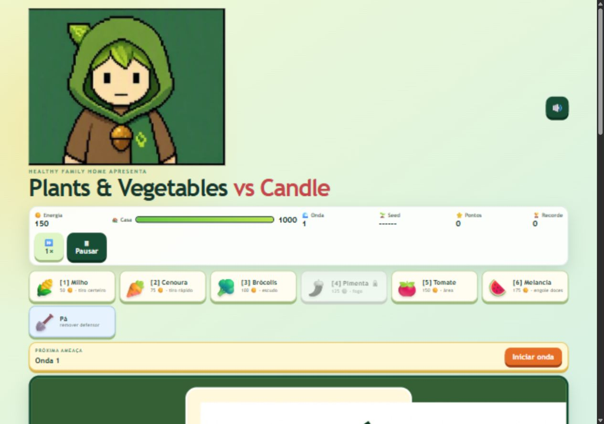
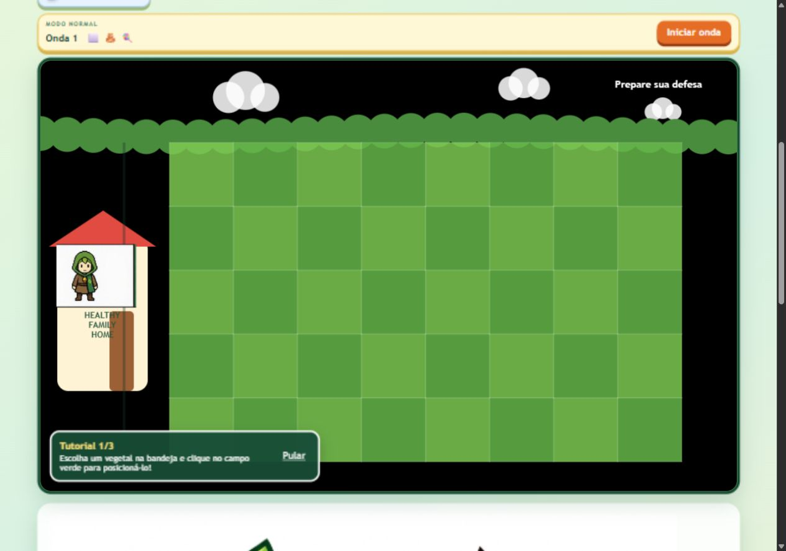
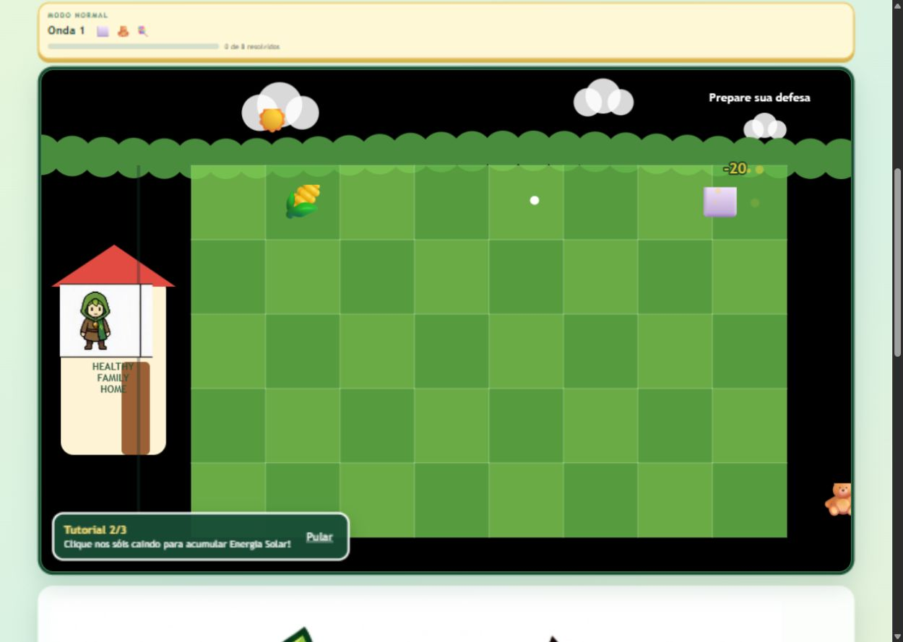
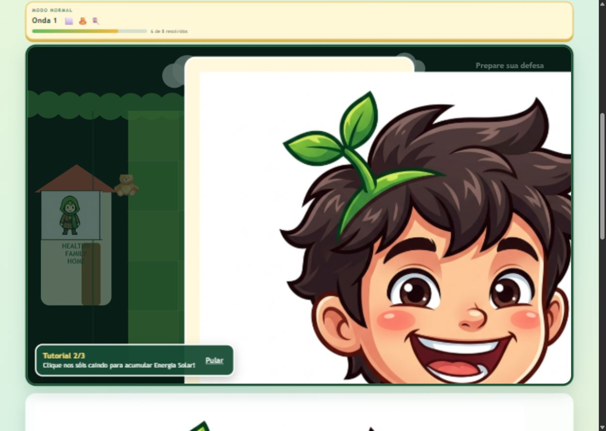
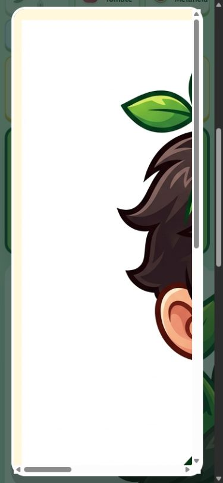
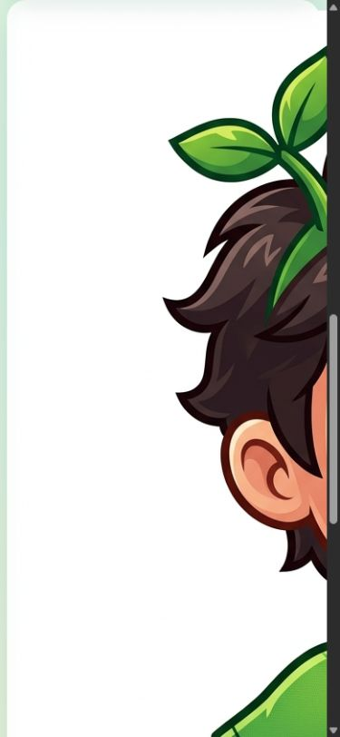

# Auditoria do jogo — 14 de agosto de 2026

## Escopo

Auditoria combinada de UX, interface, acessibilidade e funcionamento da versão atual do jogo em desktop (1280 × 900) e celular (390 × 844). O fluxo testado foi: abertura, seleção de modo, início, colocação de defensor, início da onda, combate, pausa e consulta da área de hábitos.

## Veredito

A versão ficou muito mais profunda e interessante como jogo: há modos, sementes, ondas procedurais, novos inimigos, Melancia, melhorias, habilidades, combo, recorde, tutorial e bestiário. O loop básico funciona. Porém, a versão atual não está pronta para entrega porque três regressões bloqueiam a experiência: imagens sem dimensionamento quebram as telas, a pausa reinicia a partida e a campanha termina sem enfrentar a Vela Mestra.

## Passos auditados

### 1. Abertura — saúde ruim

- Os modos e a estrutura do HUD são compreensíveis.
- `hero-avatar`, `overlay-mascot-img` e `habit-avatar` não possuem regras de tamanho no CSS. A imagem usa o tamanho natural e domina a página.
- Nenhum modo aparece selecionado na primeira abertura, embora o jogo use `normal` silenciosamente.

### 2. Preparação — saúde razoável

- O preview informa os tipos de inimigos antes da onda, uma melhoria importante para estratégia.
- O tutorial orienta o primeiro posicionamento e o defensor foi colocado corretamente.
- O céu aparece preto porque o jogo força `Phaser.CANVAS` enquanto usa preenchimento em gradiente; é necessária uma alternativa compatível com Canvas ou outro renderer.
- O herói aparece dentro de um retângulo branco sobre a casa, sem integração visual com o cenário.

### 3. Combate — saúde razoável

- Disparo, dano, pontuação, recompensa e progressão da onda funcionaram sem erros no console.
- O texto `Prepare sua defesa` continua aparecendo durante o combate.
- A campanha normal encerra na onda 3, mas `generateProceduralWave` só inclui a Vela Mestra em ondas múltiplas de 5. Portanto, a vitória da campanha declara que o chefe foi derrotado sem ele aparecer.
- O botão da pá apenas muda a aparência selecionada; não define `gameState.shovel = true`, tornando a remoção inoperante.

### 4. Pausa — saúde crítica

- A pausa reabre o modal de introdução com seletor de modo e o texto `Começar aventura`.
- Ao usar o botão desse modal, o manipulador chama `startGame()` e zera a partida em vez de continuar.
- A imagem natural do Levi cobre o título, as instruções e a ação principal; o modal fica inutilizável.

### 5. Celular — saúde crítica

- O modal vira uma grande área rolável ocupada pela imagem e a ação de começar fica fora do alcance imediato.
- A imagem da área de hábitos encobre o conteúdo, impedindo o uso dos bônus.
- Mesmo após corrigir as imagens, as células da grade ficam com aproximadamente 34 px em uma tela de 390 px, pequenas para toque preciso.

## Prioridades recomendadas

1. **P0 — Dimensionar as imagens:** limitar avatares com largura/altura explícitas, `object-fit` e regras móveis. Evitar rolagem horizontal dentro do modal.
2. **P0 — Separar pausa de reinício:** criar estado e CTA próprios para `Continuar`; preservar seed, defensores, energia, onda e pontuação.
3. **P0 — Corrigir a campanha:** colocar a Vela Mestra na onda 3 ou estender a campanha até a onda 5 e alinhar todos os textos.
4. **P0 — Ativar a pá:** definir e limpar `gameState.shovel` de modo consistente.
5. **P1 — Corrigir o cenário:** substituir o gradiente incompatível por fundo Canvas seguro ou escolher renderer compatível; atualizar `Prepare sua defesa` durante a onda.
6. **P1 — Tornar o celular jogável:** priorizar paisagem, alvos mínimos de 44 px e uma estratégia de zoom/pan ou tabuleiro adaptado.
7. **P1 — Cumprir os controles anunciados:** o rodapé promete teclas 1–6, mas não há listener de teclado. Adicionar controles reais e uma alternativa acessível ao Canvas.
8. **P2 — Completar recursos:** `bestEndlessWave` é lido mas não atualizado; `stats.habitsUsed` não é incrementado; o modo padrão precisa de estado visual selecionado.
9. **P2 — Reduzir dependência externa:** empacotar Phaser localmente para que o jogo não deixe de abrir quando o CDN estiver indisponível.

## Pontos fortes confirmados

- O loop principal abriu e funcionou sem erros no console.
- Os seis defensores, preview de onda, sementes e quatro modos aparecem na interface.
- Colocação, disparo, dano, pontuação e recompensas foram observados em execução.
- Há foco visível, regiões `aria-live`, rótulos nos principais botões e respeito a `prefers-reduced-motion`.

## Limites da evidência

Esta auditoria não completou as três ondas nem mediu balanceamento de longo prazo. Também não valida conformidade WCAG: a análise de acessibilidade combina inspeção visual, DOM e código, mas ainda exige testes completos de teclado e leitor de tela.
